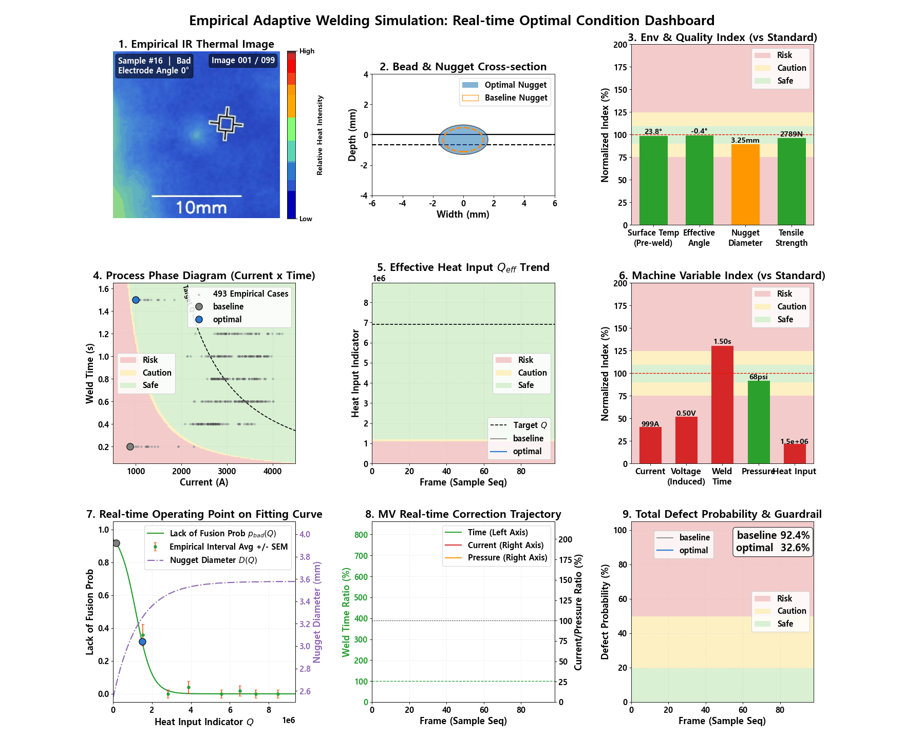
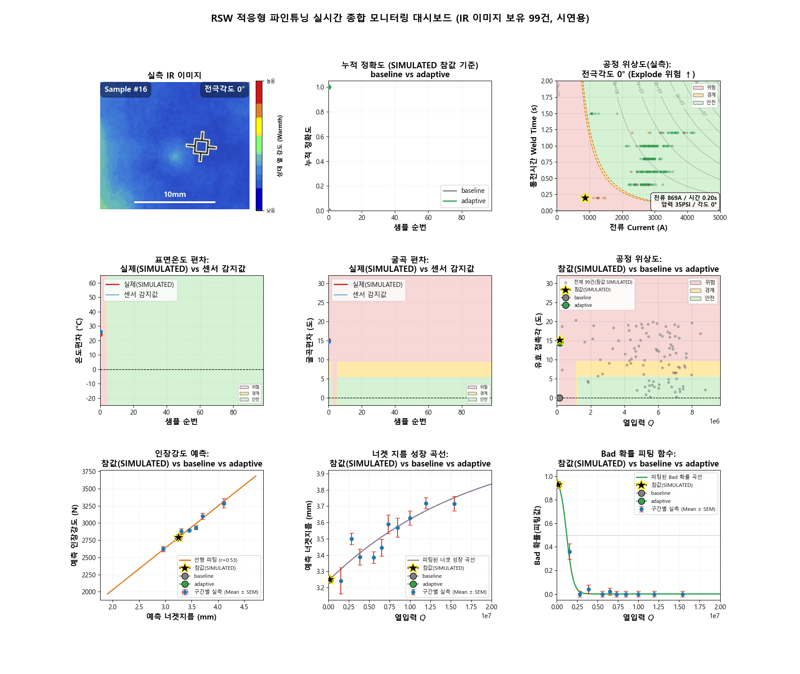

# 용접 공정 디지털 트윈: 폐루프 제어 시뮬레이션 대시보드 모음

## 개요

본 저장소는 저항 점용접(RSW, Resistance Spot Welding) 실측 데이터를 물리 모델에 피팅하고,
그 위에 확률적 외란(온도 편차, 접촉각 편차 등)을 결합해 폐루프(Closed-loop) 제어기의 실시간
대응 성능을 3x3 디지털 트윈 대시보드로 시각화한 세 개의 노트북과, 그 기반이 되는 물리 모델
피팅 노트북 한 편을 담고 있다.

| 노트북 | 데이터 성격 | 무엇을 검증하는가 |
|---|---|---|
| `1_rsw_optimization.ipynb` | 실측 493건 | 물리 모델 피팅(선행 노트북, 아래 세 노트북의 공통 기반) |
| **[B]** `2_sim_weld.ipynb` | 실측 + 합성 외란 결합 | 다변수(전류·통전시간·가압력) 폐루프 제어의 실시간 대응 |
| **[C]** `3_rsw_adaptive_finetuning.ipynb` | 실측 + 합성 외란 결합 | 센서 감지·보정 기반 적응형 판정의 baseline 대비 성능 |
| **[A]** `4_sim.ipynb` | 전 구간 합성(Synthetic) | 단일변수(토치 속도) 폐루프 제어의 개념 증명 |

파일명 앞의 숫자(1~4)는 **권장 실행 순서**를 나타낸다. `1_rsw_optimization.ipynb`을 가장 먼저
실행해야 하며, `4_sim.ipynb`는 외부 의존성이 없어 어느 시점에 실행해도 무방하다. 반면 **[A]**,
**[B]**, **[C]** 표기는 실행 순서와 무관하게 아래 본문에서 각 노트북을 지칭하기 위한 내용상의
이름표다.

**[A]**는 `Ultimate 3x3 Digital Twin: Adaptive Welding Process Simulation`이라는 제목의
단일변수 제어기를 구현하여, 단일 축 보상 체계의 구조적 한계를 정량적으로 드러낸 예비 연구다.
**[B]**는 이 한계를 계승하여 `Empirical Adaptive Welding Simulation: Real-time Optimal Condition
Dashboard`라는 제목의 다변수 제어기로 확장하고, 실측 저항 점용접 493건과 실측 IR 열화상
이미지를 결합해 개념 증명 수준을 넘어서는 결과를 제시한다. **[C]**는 제어기의 관점이 아니라
판정기의 관점에서, 표준값을 고정 적용하는 baseline과 센서로 편차를 감지·보정하는 adaptive를
비교하여 적응형 판정의 효과를 정량화한다. 이하 본문에서는 세 노트북을 각각 **[A]**, **[B]**,
**[C]**로 지칭한다.

---

## 이론적 배경

### 저항 점용접(RSW)의 결함 메커니즘과 물리 모델

저항 점용접은 두 전극 사이에 전류를 흘려 접촉저항의 줄열(Joule heating)로 금속판을 국소적으로
녹여 붙이는 공정이다. 열입력이 부족하면 모재가 충분히 녹지 않는 **미융착(Bad)**, 열입력이
과도하거나 전극이 기울어져 접촉이 불균일하면 금속이 튀는 **팽출(Explode)**이 발생한다.

$$Q = I^2 R t$$

| 기호 | 의미 |
|---|---|
| $Q$ | 열입력(단위시간당 발열량의 누적 지표) |
| $I$ | 용접 전류 |
| $R$ | 접촉저항(원 데이터셋에 미계측 -- 1 또는 온도 함수로 근사) |
| $t$ | 통전시간 |

`1_rsw_optimization.ipynb`는 실측 493건에 아래 네 개의 물리 모델을 피팅하며, **[B]**, **[C]**는
이 피팅 결과를 그대로 재사용한다.

| 모델 | 수식 | 항의 의미 |
|---|---|---|
| 미융착 확률 | $p_{bad}(Q)=\dfrac{1}{1+e^{k(Q-Q_{min})}}$ | $Q_{min}$: 확률 50%가 되는 임계 열입력, $k$: 전이 급경사도 |
| 팽출 확률 | $p_{exp}(\theta,P)=\dfrac{1}{1+e^{-z}},\ z=b_0+b_\theta\theta+b_1P+b_2P^2$ | $\theta$: 전극각도, $P$: 가압력, $b_2$: 2차항 계수(U자형 반영) |
| 너겟 성장 | $D(Q)=D_0+(D_{max}-D_0)(1-e^{-Q/\tau})$ | $D_0$: 초기 지름, $D_{max}$: 포화 지름, $\tau$: 성장 시상수 |
| 인장강도 | $F=aD+b$ | $a, b$: 너겟지름-인장강도 선형회귀 계수 |

미융착은 $Q$ 하나로, 팽출은 $\theta$와 $P$로 서로 다른 물리 인자에 지배된다는 사실이 **[B]**의
다변수 제어축 분리와 **[C]**의 두 과제 독립 평가에 공통된 근거다. 너겟 성장과 인장강도 모델은
$Q \to D \to F$로 이어지는 인과 사슬을 이루며, 세 노트북의 "피팅 곡선 위 동작점" 패널이 모두
이 사슬을 시각화한다.

### GMAW 아크 용접의 열입력과 용착 속도 ([A] 전용)

**[A]**는 저항 점용접이 아니라 가스 금속 아크 용접(GMAW)을 다루며, 열입력이 토치 이동 속도에
반비례한다는 별도의 물리를 사용한다.

$$V=V_0+E\,l_a,\qquad Q=\eta\frac{VI}{v},\qquad WFS=MR=\alpha I+\beta L_e I^2$$

| 기호 | 의미 |
|---|---|
| $V, V_0, E, l_a$ | 아크 전압, 최소 전압강하, 전계강도, 아크 길이 편차 |
| $\eta, v$ | 열효율(약 0.8), 토치 이동 속도(유일한 조작 변수) |
| $WFS, MR$ | 와이어 송급속도, 용융속도(동적 평형 관계) |
| $\alpha I,\ \beta L_e I^2$ | 아크 복사열 성분, 와이어 저항의 줄 발열 성분 |

### 대시보드 공통 표기: 공차 기반 정규화 지수

**[A]**, **[B]**의 막대그래프 패널은 단위가 다른 여러 변수를 한 축에서 비교하기 위해 다음
지수를 사용한다.

$$I_{norm}=100+10\left(\frac{X-X_0}{\Delta X_{safe}}\right)\ [\%]$$

$X$는 실시간 측정값, $X_0$는 표준값, $\Delta X_{safe}$는 변수별 허용 공차다. 100%가 표준
조건이며, 90~110%는 안전, 75~125%는 경계, 그 밖은 위험 구간으로 배경색이 채색된다.

---

## 사전 준비: `1_rsw_optimization.ipynb`

실측 저항 점용접 493건(전류·통전시간·가압력·전극각도·너겟지름·인장강도·결함라벨)과 IR 열화상
99장에 위 네 개 물리 모델을 피팅하여 `result_rsw/`에 저장하는 선행 노트북이다. **[B]**와
**[C]** 모두 이 노트북의 산출물(`step1_aggregated_samples.csv` 등)을 입력으로 재사용하므로,
**[B]**, **[C]**를 실행하기 전에 반드시 먼저 Run All 해야 한다. **[A]**는 외부 데이터
의존성이 없어 이 노트북과 무관하게 독립적으로 실행할 수 있다.

**데이터 출처:** 실제 공정 파라미터(전류, 통전시간, 가압력 등) 및 실측 열화상(IR) 이미지
데이터는 Kaggle에 공개된 'Resistance Spot Welding Insights: A Dataset Integrating Process
Parameters, Infrared, and Surface Imaging' 데이터셋을 출처로 한다(`download_rsw.py`는 동일
데이터셋의 Mendeley Data 미러에서 원본 CSV와 IR 이미지를 내려받는다).

---

## [A] `4_sim.ipynb` — 단일변수 폐루프 제어의 개념 증명

표면온도·접촉각·전류·전압 등 모든 공정 변수를 `numpy.random`으로 생성한 합성 데이터만으로
구성한 GMAW 수치 시뮬레이션이다. 제어기의 조작 변수는 토치 이동 속도 $v$ 단일 축으로 한정되며,
위 GMAW 열입력 방정식에 근거하여 유효 열입력만을 목표값으로 되돌린다.

  

| 위치 | 패널 내용 |
|---|---|
| 1행1열 | 토치 궤적 및 용융풀 냉각 모델 |
| 1행2열 | 비드 및 너겟 단면 |
| 1행3열 | 환경 변수(표면온도·접촉각·형상) 정규화 지수 |
| 2행1열 | V-I 위상 다이어그램 |
| 2행2열 | 유효 열입력 $Q_{eff}(t)$ 추이 |
| 2행3열 | 장비 제어 변수 정규화 지수 |
| 3행1열 | 조작 변수 제어 속도 $v(t)$ |
| 3행2열 | 인장 전단 강도 추정 $F_{pull}(t)$ |
| 3행3열 | 결함 확률 및 가드레일 |

**패널 간 관계 및 핵심 관측:** 제어기가 직접 보정하는 것은 2행2열의 유효 열입력뿐이며, 그
파생 지표인 1행2열(단면)과 3행2열(강도)은 함께 안정화된다. 그러나 접촉각(굴곡) 편차는 보정
구동기가 없는 순수 랜덤워크로 남아 1행3열·2행1열에서 자유롭게 발산하고, 그 결과 3행3열의
결함 확률은 공정 전 구간에서 0%와 100% 사이를 고빈도로 진동한다. 이는 제어 실패가 아니라
단일 축 보상 체계가 구조적으로 감당할 수 있는 범위의 한계를 드러내는 결과다.

---

## [B] `2_sim_weld.ipynb` — 실측 결합형 다변수 폐루프 제어

**[A]**가 남긴 단일 축 제어의 한계를, 실측 데이터에서 학습한 물리 모델과 다변수 제어 구조로
해결한 노트북이다. 미융착이 $Q$에, 팽출이 $\theta, P$에 지배된다는 이론적 배경에 근거하여
전류·통전시간으로 열입력 축을, 가압력으로 팽출 억제 축을 동시에 제어하며, 매 프레임 아래
목적함수를 최소화하는 조작 변수를 격자 탐색으로 재산정한다.

$$J(I,t,P)=w_{bad}\,p_{bad}(Q)+w_{exp}\,p_{exp}(\theta_{eff},P)+w_{heat}\left(\frac{Q-Q_{target}}{Q_{target}}\right)^2$$

  

*영문 표기 버전이며, 노트북 안에는 동일한 내용의 국문 표기 버전(`figures/3x3_weld_dashboard.gif`)도
별도 셀로 함께 생성된다.*

| 위치 | 패널 내용 |
|---|---|
| 1행1열 | 실측 IR 열화상 이미지 |
| 1행2열 | 비드 및 너겟 단면(baseline 대 optimal) |
| 1행3열 | 환경 및 품질 정규화 지수 |
| 2행1열 | 공정 위상도(전류 x 통전시간) |
| 2행2열 | 유효 열입력 $Q_{eff}(t)$ 추이 |
| 2행3열 | 장비 제어 변수 정규화 지수 |
| 3행1열 | 피팅 함수 위 실시간 동작점 |
| 3행2열 | 조작 변수 보정 궤적 |
| 3행3열 | 종합 결함 확률과 가드레일 |

**패널 간 관계:** 2행1열과 2행2열은 $Q_{lo}=Q_{min}-\sigma_{Q_{min}}$, $Q_{hi}=Q_{min}+\sigma_{Q_{min}}$
로 정의된 동일한 위험/경계/안전 임계값을 공유하며, 그 $Q_{min}$의 출처가 3행1열의 피팅 곡선이다.
1행3열과 2행3열은 같은 $I_{norm}$ 척도를 쓰되 전자는 결과(품질 지표), 후자는 원인(장비 조작
변수)을 보여준다.

**주요 결과(예비 검증):**

| 지표 | baseline | optimal | 감소율 |
|---|---|---|---|
| 미융착 확률 평균 | 0.051 | 0.003 | 94% |
| 팽출 확률 평균 | 0.025 | 0.019 | 23% |
| 종합 결함 확률 평균 | 0.071 | 0.022 | 69.5% |

가압력에 대한 결함률이 명확한 U자형 관계(35 psi 18.8%, 80 psi 1.5%, 95 psi 11.8%)를 보인다는
실측 근거로부터, 가압력을 열입력과 독립적인 제2 제어축으로 채택하였다. 그 결과 **[A]**에서
관측되었던 결함 확률의 0~100% 대진폭 진동 없이, 종합 결함 확률을 무보정 운전 대비 약 70%
감소시켰다.

**한계:** 표면온도와 판재 굴곡 편차는 원본 데이터셋에 계측되어 있지 않아 물리적으로 타당한
범위에서 합성 생성한 값이다. 따라서 개선폭의 절대값은 실제 현장 성능을 보증하지 않으며, 제어
방법론의 타당성을 확인하는 개념 증명으로 해석해야 한다. 또한 팽출 확률 모델이 접촉각과 가압력의
덧셈 구조로 되어 있어 최적 가압력이 접촉각에 무관하게 상수로 수렴하는데, 이는 전극각도 15도 x
가압력 80 psi 조건의 실측 표본이 데이터셋에 존재하지 않기 때문이다.

---

## [C] `3_rsw_adaptive_finetuning.ipynb` — 센서 감지·보정 기반 적응형 판정

**[A]**, **[B]**가 제어기(조작 변수를 재산정해 공정을 목표로 되돌리는 구조)의 관점이라면,
**[C]**는 판정기(주어진 조건에서 결함 여부를 얼마나 정확히 예측하는가)의 관점을 취한다. 실측
493건을 7:2:1로 층화 분할하여 train에서 표준 물리 모델을 학습하고, valid/test에는 판재 굴곡·
표면온도 편차를 합성 주입한 뒤, 그 편차를 전혀 모르는 baseline과 노이즈 섞인 센서로 감지해
경사하강법으로 보정하는 adaptive 중 어느 쪽이 실제(가상 참값)에 더 가까운 판정을 내리는지
비교한다. 표면온도는 접촉저항을 아래와 같이 선형적으로 변화시킨다고 가정한다.

$$R_{eff}=1+\alpha\,\Delta T,\qquad Q_{eff}=I^2 R_{eff}\,t,\qquad \alpha=0.004\ [1/^\circ\mathrm{C}]$$

  

*`RSW 적응형 파인튜닝 실시간 종합 모니터링 대시보드` — IR 이미지 보유 99건 시연용.*

| 위치 | 패널 내용 |
|---|---|
| 1행1열 | 실측 IR 열화상 이미지 + 10mm 축척바 |
| 1행2열 | baseline 대 adaptive 누적 정확도 |
| 1행3열 | 실측 공정 위상도(전류 x 통전시간) |
| 2행1열 | 표면온도 편차: 참값(SIMULATED) 대 센서 감지값 |
| 2행2열 | 굴곡 편차: 참값(SIMULATED) 대 센서 감지값 |
| 2행3열 | 공정 위상도($Q$ x 유효 접촉각), 참값·baseline·adaptive 3점 |
| 3행1열 | 인장강도 예측 곡선 |
| 3행2열 | 너겟 성장 곡선 |
| 3행3열 | 미융착 확률 피팅 곡선 |

**패널 간 관계:** 2행1열의 위험/경계/안전 배경은 3행3열 미융착 임계값 $Q_{min}$을 그 샘플의
전류·통전시간을 고정한 채 $\Delta T$ 축으로 역산한 것이고, 2행2열의 배경은 팽출 임계값(전극각도
7.5도)을 접촉각 편차 축으로 역산한 것이다. 즉 네 패널(2행1·2열, 3행3열, 1행3열)이 하나의 판정
기준을 서로 다른 좌표축에서 바라본다.

**주요 결과(TEST 약 50건):**

| 과제 | 방식 | Accuracy | Precision | Recall | F1 |
|---|---|---|---|---|---|
| Bad(열입력) | baseline / adaptive | 1.000 | 1.000 | 1.000 | 1.000 |
| Explode(굴곡) | baseline | 0.760 | 1.000 | 0.707 | 0.829 |
| Explode(굴곡) | adaptive | 0.960 | 0.976 | 0.976 | 0.976 |

Explode(굴곡) 과제에서 adaptive는 baseline이 놓치던 위험 표본(recall 0.707 -> 0.976)을
크게 줄여, 노이즈가 섞인 불완전한 센서 정보라도 활용하는 편이 이를 무시하는 것보다 체계적으로
낫다는 것을 보인다. Bad(열입력) 과제는 이번 TEST 표본의 양성이 2건뿐이라 baseline·adaptive
지표가 완전히 동일하게 나왔으며, 이는 개선이 없다는 뜻이 아니라 이 표본 크기로는 판별할 수
없다는 뜻이다.

**한계:** 참값 자체가 합성 편차로부터 계산된 시뮬레이션 내부값이므로, 이 결과는 실측 미지
데이터에 대한 성능 검증이 아니라 편차 감지·보정 메커니즘이 원리적으로 작동한다는 방법론적
증명으로 해석해야 한다.

---

## 재현 방법

1. `download_rsw.py` 실행 -- `Data/Resistance Spot Welding Insights/`에 실측 CSV와 IR 이미지
   99장을 내려받는다.
2. `1_rsw_optimization.ipynb` Run All -- 실측 493건에 물리 모델을 피팅하여 `result_rsw/`에
   산출물을 저장한다. **[B]**, **[C]**가 이 산출물을 입력으로 사용한다.
3. `2_sim_weld.ipynb` Run All -- **[B]**의 대시보드 GIF(국문/영문)와 중간 결과 CSV를
   `result_sim_weld/`에 저장한다.
4. `3_rsw_adaptive_finetuning.ipynb` Run All -- **[C]**의 대시보드 GIF와 중간 결과 CSV를
   `result_rsw_adaptive/`에 저장한다.
5. `4_sim.ipynb` Run All -- 외부 데이터 의존성 없이 **[A]**의 대시보드 GIF를 `result_sim/`에
   저장한다(1, 2단계와 무관하게 독립적으로 실행 가능).

## 산출물 구조

`result_rsw/`, `result_sim/`, `result_sim_weld/`, `result_rsw_adaptive/` 폴더에 각 노트북의
셀별 산출물이 `stepN_설명.csv` 규칙으로 저장되며, 대시보드 애니메이션은 `figures/` 하위에
GIF로 저장된다. 모두 노트북 재실행으로 동일하게 재생성되므로 저장소에는 포함하지 않았다
(`.gitignore` 참고). 본문에 첨부한 세 개의 GIF는 `assets/dashboards/`에 별도로 보관한다.
